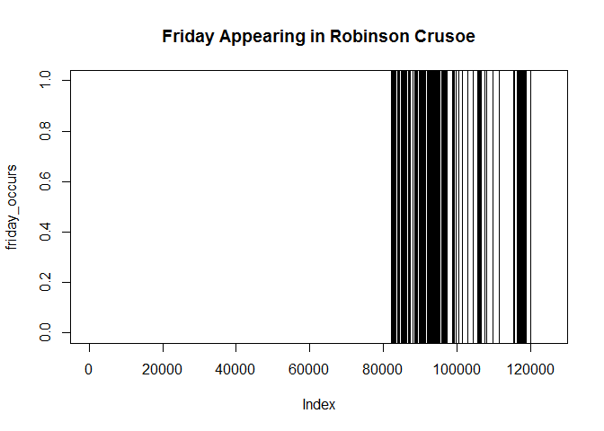

Convenient Base R String Handling
=================================

Status
------

first stable release

[](https://travis-ci.org/petermeissner/stringb) [](https://codecov.io/gh/petermeissner/stringb/tree/master/R) [](https://cran.r-project.org/package=stringb)

**Version**

0.1.12

**License**

MIT + file LICENSE <br>Peter Meissner <retep.meissner@gmail.com> \[aut, cre\]

**Description**

Base R already ships with string handling capabilities 'out-of-the-box' but lacks streamlined function names and workflow. The 'stringi' ('stringr') package on the other hand has well named functions, extensive Unicode support and allows for a streamlined workflow. On the other hand it adds dependencies and regular expression interpretation between base R functions and 'stringi' functions might differ. This packages aims at providing a solution to the use case of unwanted dependencies on the one hand but the need for streamlined text processing on the other. The packages' functions are solely based on wrapping base R functions into 'stringr'/'stringi' like function names. Along the way it adds one or two extra functions and last but not least provides all functions as generics, therefore allowing for adding methods for other text structures besides plain character vectors.

**This packages aims at:**

-   **no dependencies** except what comes with base-R (i.e. there shall be no compilation needed)
-   for good or worse relying on base-R text handling mechanisms means getting **base-R regular expression engine including the Perl mode**
-   writing **text handling functions as generics** so that methods for all kind of structures containing text can be added
-   providing functions that allow for different character encodings
-   but rigorously defaulting to UTF-8 as expected input and default output therby enhancing cross platform cooperation
-   adding more power to general basic text handling functions by additional options (e.g. the text\_read() function allows to read in and tokenize text in one function call)
-   and insisting on a **flat interface** - meaning that all functionality should come from functions and plain parameters (in contrast to e.g. parameters that need specialised functions or funtions outputs to perform)
-   adding further general text handling tools if there is a general enough purpose for the added function(ality)

**This package does not aim at:**

-   beeing fast (fast is good but will not be traded for the above listed aims - stringi might be your friend here)
-   beeing ultimativly compatible (compatible is good but again will not be traded for the above listed aims - again stringi might be your solution in that case)

Contribution
------------

Note, that this package uses a Contributor Code of Conduct. By participating in this project you agree to abide by its terms: <http://contributor-covenant.org/version/1/0/0/> (basically this should be a place were people get along with each other respectful and nice because it's simply more fun that way for everybody)

Contributions are very much welcome, e.g. in the form of:

-   **typo fixing** ([edit file directly on Github](https://help.github.com/articles/editing-files-in-another-user-s-repository/))
-   **bug reporting** (file an [issue](https://guides.github.com/features/issues/) - after having searched if the issue came up before - as - if possible - [minimal reproducable example](http://stackoverflow.com/help/mcve))
-   **extending help files** (e.g. [edit the respective files directly on Github](https://help.github.com/articles/editing-files-in-another-user-s-repository/) or [fork the package](https://help.github.com/articles/fork-a-repo/) and later on make a [pull request](https://help.github.com/articles/using-pull-requests/); note, that the package use [roxygen2](http://r-pkgs.had.co.nz/man.html) for easing documentation)
-   **writing example** (e.g. [edit the respective files directly on Github](https://help.github.com/articles/editing-files-in-another-user-s-repository/) or [fork the package](https://help.github.com/articles/fork-a-repo/) and later on make a [pull request](https://help.github.com/articles/using-pull-requests/); note, that the package use [roxygen2](http://r-pkgs.had.co.nz/man.html) for easing documentation)
-   **vignette writing** (file an [issue](https://guides.github.com/features/issues/) first so that we can discuss htings than [fork the package](https://help.github.com/articles/fork-a-repo/) and later on make a [pull request](https://help.github.com/articles/using-pull-requests/))
-   **test writing** (have a look at the [test coverage](https://codecov.io/gh/petermeissner/stringb/tree/master/R) than [fork the package](https://help.github.com/articles/fork-a-repo/) and later on make a [pull request](https://help.github.com/articles/using-pull-requests/))
-   **feature suggestions** (file an [issue](https://guides.github.com/features/issues/) describing the idea, why this is important, possible alternative solutions and an example)
-   **general discussion** of approach and or implementation (file an [issue](https://guides.github.com/features/issues/))
-   implementation **improvements** (file an [issue](https://guides.github.com/features/issues/) naming whats to be improved, why and how)

Installation
------------

``` r
devtools::install_github("petermeissner/stringb")
library(stringb)
```

Function list
-------------

``` r
library(stringb)
objects("package:stringb")
```

    ##  [1] "%..%"                    "%.%"                     "text_c"                 
    ##  [4] "text_collapse"           "text_count"              "text_delete"            
    ##  [7] "text_detect"             "text_dup"                "text_eval"              
    ## [10] "text_extract"            "text_extract_all"        "text_extract_group"     
    ## [13] "text_extract_group_all"  "text_filter"             "text_grep"              
    ## [16] "text_grepl"              "text_grepv"              "text_length"            
    ## [19] "text_locate"             "text_locate_all"         "text_locate_group"      
    ## [22] "text_nchar"              "text_pad"                "text_read"              
    ## [25] "text_rep"                "text_replace"            "text_replace_all"       
    ## [28] "text_replace_group"      "text_replace_locates"    "text_show"              
    ## [31] "text_snippet"            "text_split"              "text_split_n"           
    ## [34] "text_sub"                "text_subset"             "text_tokenize"          
    ## [37] "text_tokenize_lines"     "text_tokenize_sentences" "text_tokenize_words"    
    ## [40] "text_to_lower"           "text_to_title_case"      "text_to_upper"          
    ## [43] "text_trim"               "text_which"              "text_which_value"       
    ## [46] "text_wrap"               "text_write"

Example Usage
-------------

``` r
library(stringb)
(test_file <- stringb:::test_file("rc_1_ch1.txt")) # just a file accompanying the package to test things
```

    ## [1] "/home/peter/R/x86_64-pc-linux-gnu-library/3.3/stringb/testfiles/rc_1_ch1.txt"

``` r
text_read( test_file, tokenize = "\\W", n=20)[67:79]
```

    ##  [1] "Project"   "Gutenberg" "License"   "included"  "with"      "this"      "eBook"     "or"       
    ##  [9] "online"    "at"        "www"       "gutenberg" "org"

Although, text\_read() is just a wrapper araound readLines() it has become more powerful, consistent and streamlined by (1) always producing UTF-8 encoded character vectors, (2) allowing the usage of all readLines() options - e.g. n, (3) and adding further useful functionality like on-the-fly-tokenization.

``` r
library(stringb)
(test_file <- stringb:::test_file("rc_3.txt")) # just a file accompanying the package to test things
```

    ## [1] "/home/peter/R/x86_64-pc-linux-gnu-library/3.3/stringb/testfiles/rc_3.txt"

``` r
text          <- text_read(test_file, tokenize = "\\W+")
friday_occurs <- text_detect(text, "FRIDAY", ignore.case=TRUE)

plot(friday_occurs, type = "n")
abline(v=which(friday_occurs))
title("Friday Appearing in Robinson Crusoe")
```



Text\_detect() is another example for a streamlined interface (easier to remeber than grepl) with all base-R whistles and bells still beeing there - almost all base-R pattern matching functions have the ignore.case options to make pattern matching case insensitive.

``` r
library(stringb)
(test_file <- stringb:::test_file("rc_3.txt")) # just a file accompanying the package to test things
```

    ## [1] "/home/peter/R/x86_64-pc-linux-gnu-library/3.3/stringb/testfiles/rc_3.txt"

``` r
text          <- text_read(test_file)

plot(text, pattern="Friday", ignore.case=TRUE)
```


A simple method to plot character vectors with pattern markup was added as well.
